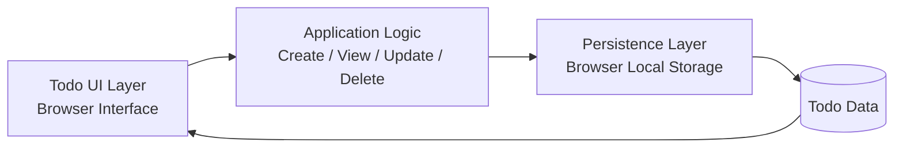

# Architecture

## 1. Architecture Overview

The application will be a simple single-user web application with a browser-based interface. It will have a minimal client-side architecture composed of a UI layer, application logic, and a local persistence layer.

This architecture directly satisfies the approved requirements:

- The app is a browser-based todo manager (FR-003, NFR-002)
- It supports create, view, update, and delete todo actions (FR-001, FR-003, FR-004, FR-005)
- It is single-user and has no authentication (FR-007, A-001)
- Todo items persist across browser sessions (FR-006, NFR-001, A-002)
- The scope remains intentionally limited to basic task management (NFR-003, Out of Scope)

The design intentionally avoids a backend service, database server, authentication system, and any external integrations because those are not required by the approved requirements.

## 2. Architecture Diagram

## 3. Components

### 1. Todo UI Layer

- Name: Todo UI Layer
- Responsibility: Render the todo list, display task titles and completion status, collect user input, and provide actions for creating, editing, and deleting todo items.
- Interaction: Sends user actions to the application logic and refreshes the visible list after state changes or reloads.

### 2. Application Logic

- Name: Application Logic
- Responsibility: Manage the todo list state, validate user input, process create/update/delete requests, and coordinate updates with persistence.
- Interaction: Receives events from the UI, updates in-memory todo data, and calls the persistence layer to save changes.

### 3. Persistence Layer

- Name: Persistence Layer
- Responsibility: Store todo items in browser local storage so they survive application restarts and remain available after the browser is reopened.
- Interaction: Loads persisted data on startup and saves all CRUD changes whenever the todo list is updated.

### 4. Todo Data Store

- Name: Todo Data Store
- Responsibility: Hold the persisted todo items in a browser-local representation; no server-side storage or database is required.
- Interaction: Read by the app during initialization and written by the persistence layer after each change.

## 4. Data Flow

### Creating a Todo

1. The user enters a title and optionally marks the item as complete or incomplete.
2. The UI sends the create request to the application logic.
3. The application logic validates the title and creates a todo item object.
4. The application logic adds the item to the current list and calls the persistence layer.
5. The persistence layer writes the complete list to browser local storage.
6. The UI refreshes to show the new todo item.

### Viewing Todos

1. On application load, the UI requests current todo data from the application logic.
2. The application logic loads the saved list from the persistence layer.
3. The persistence layer reads the todo items from browser local storage.
4. The UI renders the list of todo items with each title and completion status visible.

### Updating a Todo

1. The user selects an existing todo item and changes its title or completion status.
2. The UI sends the update request to the application logic.
3. The application logic validates the updated todo item and updates the item in the in-memory list.
4. The updated todo list is saved through the persistence layer.
5. The UI refreshes the list to reflect the change.

### Deleting a Todo

1. The user triggers delete for an item.
2. The UI passes the item identifier to the application logic.
3. The application logic removes the todo item from the list.
4. The persistence layer writes the updated list back to browser local storage.
5. The UI refreshes to remove the item from view.

### Persisting Todo Data

- The persistence layer writes the full list of todo items to browser local storage after create, update, and delete operations.
- This ensures data remains available after the application is closed and reopened.

### Loading Persisted Todo Data

- On startup, the application logic requests stored data from the persistence layer.
- The persistence layer reads the browser local storage entry.
- The UI renders the recovered list, preserving the user's previous tasks.

## 5. Data Model

The todo entity is intentionally minimal and aligned with the approved requirements.

Todo entity:

- title: string
  - Required
  - Represents the task description
- completed: boolean
  - Required
  - Indicates whether the task is complete or incomplete

Additional fields are not required by the approved requirements and are intentionally excluded to keep the solution simple and focused.

The todo list is a collection of todo objects stored in a single structure such as an array in browser local storage.

## 6. Technology Choices

### Browser-based web application

- Reason: The approved requirements explicitly state that the application is a simple web app with a browser-based interface.

### HTML, CSS, and JavaScript

- Reason: This is the most direct and minimal technology choice for a single-user browser UI with basic CRUD interactions.
- It keeps implementation simple and appropriate for a small project focused on an AI-assisted development lifecycle.

### Browser Local Storage

- Reason: The requirements mandate persistence across sessions and reject complexity. Local storage is the simplest built-in browser persistence mechanism for a single-user app without a backend or authentication system.
- It meets the requirement to retain todo data after closing and reopening the app with minimal infrastructure.

### No backend server

- Reason: The approved requirements do not require remote storage, multi-user access, or authentication. A server would add unnecessary complexity and infrastructure without traceable value.

## 7. Architectural Decisions

### Decision 1: Client-side architecture only

- Rationale: The product is a single-user browser app, and the requirements do not call for multi-user support, authentication, or remote services.
- Traceability: FR-007, A-001, NFR-003

### Decision 2: Browser local storage for persistence

- Rationale: Persistence is required across sessions, and the application remains intentionally simple. Local storage is a minimal built-in mechanism that satisfies this requirement without introducing a database or server.
- Traceability: FR-006, NFR-001, A-002

### Decision 3: Minimal todo data model

- Rationale: The approved requirements specify only a title and completion status as mandatory fields. No additional data is required.
- Traceability: FR-001, FR-002, A-003

### Decision 4: No authentication or user accounts

- Rationale: The requirements explicitly define a single-user application with no authentication or user accounts.
- Traceability: FR-007, A-001, Out of Scope

### Decision 5: No advanced features

- Rationale: The user story and scope explicitly state that the app should remain simple and should not include unnecessary advanced functionality.
- Traceability: NFR-003, Scope Excluded, Out of Scope

## 8. Security Considerations

The security considerations are limited to the approved scope of a single-user browser application.

- No authentication is required because the application is single-user only.
- No user data should be exposed beyond the local browser environment for this project.
- The app should avoid storing sensitive or unnecessary data beyond the required todo fields.
- Since there is no multi-user access or server component, there is no need for authorization, session management, or external security infrastructure.

## 9. Testing Considerations

The architecture supports concise unit and integration testing without requiring a complex environment.

### Unit tests

- Validate the application logic for:
  - creating a todo item with a valid title
  - rejecting invalid or empty title input
  - updating an existing todo item
  - marking a todo as complete or incomplete
  - deleting a todo item

### Integration tests

- Validate the full browser flow for:
  - adding a todo and seeing it appear
  - viewing the stored todo list
  - editing a todo and observing the updated state
  - deleting a todo and ensuring it disappears
  - reloading the app and confirming persistence across sessions

### Testability advantages

- The architecture is simple and uses browser local storage, which can be exercised in a browser automation test or a lightweight front-end test environment.
- The app has no server-side complexity, reducing the number of moving parts to validate.

## 10. Constraints and Assumptions

### Constraints

- The application must remain browser-based and simple.
- The application is single-user only.
- No external services or infrastructure are permitted.
- Todo data must persist across sessions.
- No advanced features beyond core CRUD will be implemented.

### Assumptions

- The browser environment is the primary execution context.
- Persistence is local to the browser and does not require cross-device sync.
- The todo list is small and does not need high-scale storage or concurrency handling.
- A minimal front-end implementation is sufficient to satisfy the approved requirements.

## Final Validation

This architecture satisfies the approved requirements because it provides:

- a browser-based single-user todo interface
- CRUD functionality for todo items
- persistence across sessions via browser local storage
- a minimal data model aligned with the requirement of title and completion status
- no unnecessary services, infrastructure, authentication, or advanced features

Every major component in this architecture has a clear responsibility, the data flow is straightforward, persistence is addressed, and the design remains intentionally simple and implementable.
